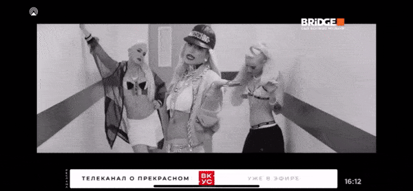

# AVPlayerKit

AVPlayerKit — набор расширений и UI-компонентов для построения медиаплееров на базе `AVFoundation`. Пакет упрощает работу с `AVPlayer`, предоставляет готовые представления управления воспроизведением и инструменты для интеграции с системным `Now Playing` и `MPRemoteCommandCenter`.

## Возможности
- **Расширения AVFoundation**. Удобные инициализаторы и вспомогательные методы для `AVPlayer`, `AVPlayerItem` и `AVAsset`.
- **Контроллер плеера**. `PlayerViewController` объединяет `PlayerView`, `PlayerStatusView` и `PlayerControlsView` для быстрого создания интерфейса воспроизведения.
- **Статусы и задержки**. `PlayerStatusView` выводит состояние плеера, а `PlayerStallsObserver` отслеживает буферизацию.
- **Now Playing**. `NowPlayingInfoBuilder` подготавливает словарь для `MPNowPlayingInfoCenter`.
- **Дистанционное управление**. `RemoteCommandCenter` регистрирует действия в `MPRemoteCommandCenter`.

## Установка

### Swift Package Manager

Добавьте зависимость в `Package.swift` проекта:

```swift
dependencies: [
    .package(url: "https://github.com/<your-org>/AVPlayerKit.git", branch: "main")
]
```

и подключите продукт `AVPlayerKit` к целевой сборке:

```swift
.target(
    name: "YourApp",
    dependencies: [
        .product(name: "AVPlayerKit", package: "AVPlayerKit")
    ]
)
```

## Быстрый старт

```swift
import AVFoundation
import AVPlayerKit

let urlString = "https://example.com/video.mp4"
guard let player = AVPlayer(urlString: urlString) else {
    return
}

player.play()
```

`AVPlayer(urlString:)` вернёт `nil`, если передан некорректный URL.

## Использование `PlayerViewController`

```swift
import AVPlayerKit

// Инициализируем `AVPlayer` медиапотоком, который требуется воспроизвести.
let streamURL = URL(string: "https://example.com/stream.m3u8")!
let player = AVPlayer(url: streamURL)
// Создаём `PlayerViewController` и привязываем к нему плеер.
let playerViewController = PlayerViewController()
playerViewController.playerView.player = player
// Включаем встроенную кнопку AirPlay.
playerViewController.enableAirPlay()

// Добавляем контроллер плеера в текущую иерархию `UIViewController`.
addChild(playerViewController)
view.addSubview(playerViewController.view)
// Растягиваем представление плеера на всю область и завершаем добавление контроллера.
playerViewController.view.frame = view.bounds
playerViewController.didMove(toParent: self)
```

`PlayerViewController` автоматически отслеживает состояние `AVPlayer`, отображает ошибки и анимацию буферизации.

## Наблюдение за состоянием плеера

Свойства `playerView`, `player` и `playerItem` поддерживают KVO-наблюдение через property wrapper `@ObservedNSObject`:

```swift
let playerViewController = PlayerViewController()

// Наблюдаем за изменением плеера.
playerViewController.$player.addObserver(self, keyPath: \.timeControlStatus) { player, _ in
    switch player.timeControlStatus {
    case .playing:
        print("Воспроизведение")
    case .paused:
        print("Пауза")
    case .waitingToPlayAtSpecifiedRate:
        print("Буферизация")
    @unknown default:
        break
    }
}

// Наблюдаем за изменением текущего элемента воспроизведения.
playerViewController.$playerItem.addObserver(self, keyPath: \.status) { playerItem, _ in
    if playerItem.status == .readyToPlay {
        print("Готов к воспроизведению")
    }
}
```

## AirPlay



```swift
import AVPlayerKit

let playerViewController = PlayerViewController()
playerViewController.enableAirPlay()
```

`AVRoutePickerView` автоматически отображает список доступных маршрутов воспроизведения.

## Картинка в картинке (Picture-in-Picture)

```swift
import AVPlayerKit

let playerViewController = PlayerViewController()
playerViewController.enablePictureInPicture()
```

Для обработки событий PiP реализуйте протокол `AVPictureInPictureControllerEventDelegate`:

```swift
extension YourViewController: AVPictureInPictureControllerEventDelegate {
    func pictureInPictureController(
        _ pictureInPictureController: AVPictureInPictureController,
        event: AVPictureInPictureController.Event
    ) {
        switch event {
        case .willStart:
            print("PiP начинает запуск")
        case .didStart:
            print("PiP запущен")
        case .failedToStart(let error):
            print("Ошибка запуска PiP: \(error)")
        case .willStop:
            print("PiP начинает завершение")
        case .didStop:
            print("PiP завершён")
        }
    }
}

// Установка делегата
playerViewController.setPictureInPictureControllerEventDelegate(self)
```

> **Примечание:** Для работы PiP необходимо включить capability **Background Modes → Audio, AirPlay, and Picture in Picture** в настройках таргета.

### Использование AVPictureInPictureControllerDelegateProxy

`AVPictureInPictureControllerDelegateProxy` — прокси-класс для обработки событий `AVPictureInPictureControllerDelegate` с поддержкой множественных подписчиков. Позволяет нескольким объектам получать события PiP без необходимости передавать делегат напрямую.

```swift
import AVKit
import AVPlayerKit

let pipController = AVPictureInPictureController(playerLayer: playerLayer)
let delegateProxy = AVPictureInPictureControllerDelegateProxy()

// Устанавливаем прокси как делегат контроллера PiP
pipController?.delegate = delegateProxy

// Добавляем подписчиков на события
delegateProxy.setDelegate(self)
delegateProxy.setDelegate(analyticsHandler)

// Для восстановления UI после выхода из PiP устанавливаем dataSource
delegateProxy.dataSource = self
```

Реализуйте `AVPictureInPictureControllerDataSource` для восстановления интерфейса:

```swift
extension YourViewController: AVPictureInPictureControllerDataSource {
    func pictureInPictureController(
        _ pictureInPictureController: AVPictureInPictureController,
        restoreUserInterfaceForPictureInPictureStopWithCompletionHandler completionHandler: @escaping (Bool) -> Void
    ) {
        // Восстанавливаем UI (например, показываем контроллер плеера)
        present(playerViewController, animated: true) {
            completionHandler(true)
        }
    }
}
```

Для удаления подписчика используйте `removeDelegate(_:)`:

```swift
delegateProxy.removeDelegate(self)
```

## Интеграция с Now Playing


```swift
import MediaPlayer
import AVPlayerKit

var nowPlaying = NowPlayingInfoBuilder(title: "AVPlayer Demo", artist: "Bridge TV")
nowPlaying.mediaType = .video
if let cover = UIImage(named: "cover") {
    nowPlaying.setArtwork(cover)
}

MPNowPlayingInfoCenter.default().nowPlayingInfo = nowPlaying.build()
```

`NowPlayingInfoBuilder` поддерживает установку обложки через `UIImage` или `Data` и флаг прямого эфира `isLiveStream`.

## Дистанционное управление воспроизведением

```swift
import AVPlayerKit

let player = AVPlayer(url: streamURL)
let remoteCommandCenter = RemoteCommandCenter()

// Регистрируем обработчик команды воспроизведения.
remoteCommandCenter.addAction(\.playCommand) { [weak player] _ in
    // Запускаем воспроизведение при сигнале от внешнего пульта.
    player?.play()
    return .success
}

// Регистрируем обработчик команды паузы.
remoteCommandCenter.addAction(\.pauseCommand) { [weak player] _ in
    // Приостанавливаем воспроизведение при сигнале от внешнего пульта.
    player?.pause()
    return .success
}
```

При необходимости отключите обработчики, например, в `deinit` контроллера.

```swift
deinit {
    remoteCommandCenter.removeAction(\.playCommand)
    remoteCommandCenter.removeAction(\.pauseCommand)
}
```

Чтобы временно отключить ответ на команды без удаления обработчиков, установите `isEnabled = false`:

```swift
remoteCommandCenter.isEnabled = false
// ... выполняем действия, во время которых не нужно реагировать на команды.
remoteCommandCenter.isEnabled = true
```

## Диагностика потоков

```swift
import AVFoundation
import AVPlayerKit

let streamURL = URL(string: "https://example.com/stream.m3u8")!
let asset = AVAsset(url: streamURL)
asset.validate { error in
    if let error {
        print(error.localizedDescription)
    }
}
```

Метод `validate(completion:)` проверяет готовность потока к воспроизведению и защищённость контента.

## Аналитика просмотра

```swift
if let watched = player.currentItem?.durationWatched() {
    print("Просмотрено: \(watched) секунд")
}
```

`durationWatched()` суммирует длительность просмотра по данным `AVPlayerItemAccessLog`.

## Документация

Дополнительные материалы находятся в каталоге `Sources/AVPlayerKit.docc/`. Откройте проект в Xcode и соберите документацию через **Product → Build Documentation**.
